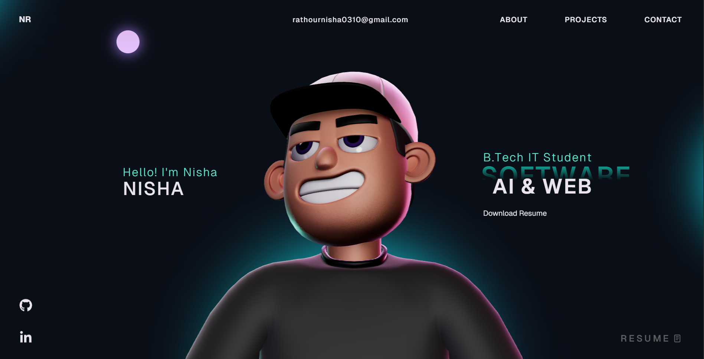

# Nisha Portfolio Website 🚀

This repository contains the source code for my personal developer portfolio website.

The portfolio showcases my projects, technical skills, and experience in software development, artificial intelligence, and modern web development technologies.

---

## 🌐 Live Demo

(Will be updated after deployment)

https://nisha-portfolio.vercel.app

---

## 📸 Portfolio Preview

---

## 🛠 Tech Stack

This portfolio is built using modern web technologies:

React  
TypeScript  
GSAP  
Three.js  
WebGL  
HTML5  
CSS3  
JavaScript

---

## ✨ Features

Interactive UI with smooth animations  
3D Tech Stack visualization using Three.js  
Project showcase section  
Career & experience timeline  
Responsive design  
Downloadable resume  
Animated loading screen

---

## 📂 Projects Highlighted

GenRx  
AI-powered pharmacogenomic clinical decision support system that analyzes genomic data and generates personalized drug response insights.

CodeCraft AI  
AI coding assistant capable of generating and explaining code using AI APIs.

---

## ⚙️ Run Locally

Clone the project

git clone https://github.com/Nisha1608/nisha-portfolio.git

Go to the project directory

cd nisha-portfolio

Install dependencies

npm install

Run the development server

npm run dev

---

## 📁 Project Structure

src  
 ├── components  
 ├── styles  
 ├── utils  
 ├── context  
 └── assets

public  
 ├── images  
 └── resume.pdf

---

## 👩‍💻 Author

Nisha  
B.Tech Information Technology  
ABES Engineering College

Email  
rathournisha0310@gmail.com

GitHub  
https://github.com/Nisha1608

---

## 🚀 Future Improvements

Add blog section  
Improve performance optimization  
Add more interactive 3D animations  
Add more real-world projects

---

## 📜 License

This project is open source and available under the MIT License.
